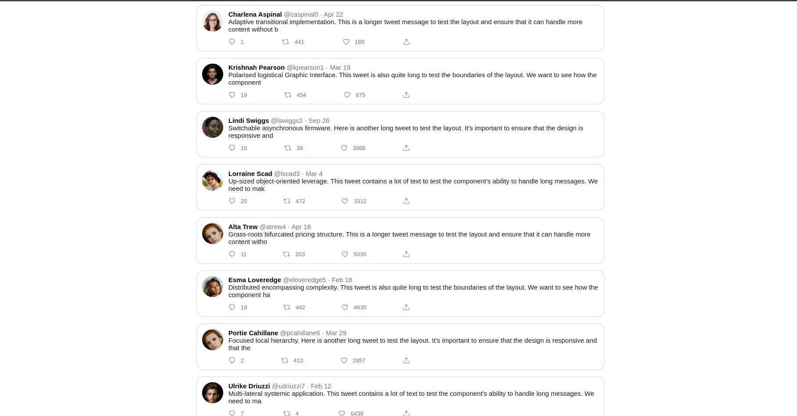

# Tweet

## Requirements

- Tweet
  - Background color: `#fff`
  - Border color: `#cfd9de` 
  - Border width: `1px` 
  - Border radius: `16px` 
  - Padding: `12px`
- Thumbnail
  - size `48px`
  - Fully rounded
- Name
  - Color `#000`
  - Font family: `sans-serif`
  - Font size: `15px`
  - Font weight: `bold`
- Metadata
  - Color: `#71767b`
  - Font family: `sans-serif`
  - Font size: `15px`
  - Use `&middot;` for the dot
- Message
  - Color: `#0f1419`
  - Font family: `sans-serif`
  - Font size: `15px`
- Actions Row
  - Max width: `425px`
  - Equal spacing between each action
- Icon
  - Color: `#536471`
  - Size: `16px`
  - Vertically centered with the count
- Action Count
  - Color: `#536471`
  - Font size: `13px`

## Final Implementation

